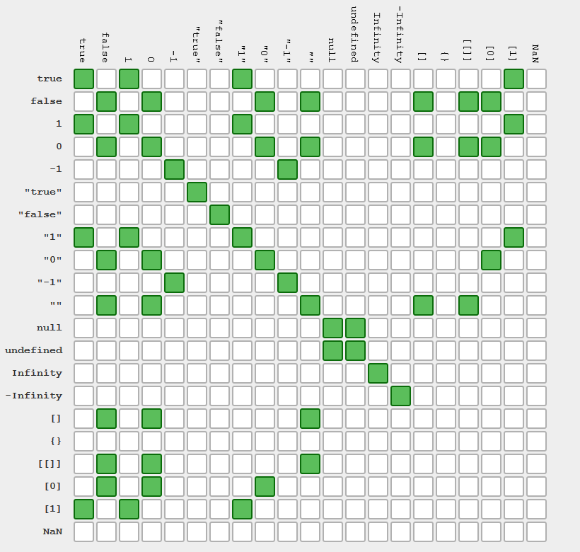
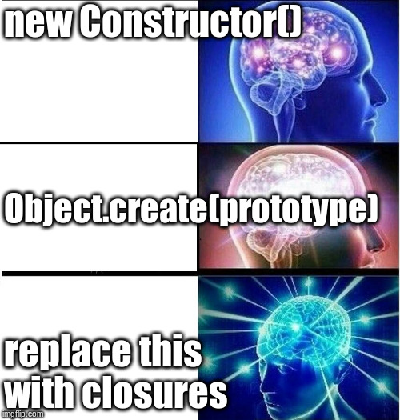

# Introduction to JavaScript

## History


* Designed and implemented as *LiveScript* over 10 days in 1995 by Brendan Eich at Netscape
* Mixture of ideas from Scheme and Self, with surface syntax borrowed from Java
* Later renamed to *JavaScript*&trade; for marketing purposes
* Standardized as *EcmaScript* in 1997
* Long version gap between 2005 and 2015
  * Time for browser implementers to catch up
  * AJAX revolution
  * Node.js
* Yearly releases since 2015 (ES6)

## Platforms

* Browser
  * Trinity: HTML, CSS and JS
  * Form validation
  * DOM manipulation
  * Full-blown client applications
* Node.js
  * Asynchronous server code
  * Better live experience during development

## Type system

* Dynamically typed
* Primitives
  * `undefined`
  * `null`
  * `boolean`
  * `number`
  * `string`
* Objects

### Undefined

* A singleton type consisting of the `undefined` value
* `undefined` is the value of:
  * uninitialized variables
  * function calls without `return`
  * missing object properties

### Null

* A singleton type consisting of the `null` value

### Boolean

* A conditional type consisting of two values:
  * `false`
  * `true`

### Number

* Implemented as IEEE754 double precision
  * `0.1 + 0.2 == 0.30000000000000004`
  * Integers up to `9007199254740992` (9 quadrillion, 9 Billiarden) can be represented exactly

### String

* UTF-16
* `"hello"`
* `'world'`
* JavaScript has no character type
  * `s[i]` yields string of length 1
  * `s.length` is not a method

## Variables

* `var a = 1;` has function scope
* `let b = 2;` has block scope
* `const c = 3;` like let, but immutable

## Equality

https://stackoverflow.com/a/23465314

* Type-safe equality via `===` and `!==` (tests type and value)


* Type-unsafe equality via `==` and `!=` (confusing type coercions)



* There is no universal `equals` method for object equality

## Primitive values vs. primitive objects

* Primitive values have no methods
* Yet calling methods on primitive values appears to be possible
* Behind the scenes, a coercion from primitive value to primitive object takes place
* This conversion can be requested manually as well:
  * `false` vs. `new Boolean(false)`
  * `42` vs. `new Number(42)`
  * `'hello'` vs. `new String('hello')`

## Falsy values

The following values are treated as false in conditions:
* `null`
* `undefined`
* `false`
* `+0.0`
* `-0.0`
* `NaN`
* `''`

Note: Primitive objects such as `new Boolean(false)` are truthy!

## Control flow

```js
let coin;
if (Math.random() < 0.5) {
    coin = 'heads';
} else {
    coin = 'tails';
}

const coin = Math.random() < 0.5 ? 'heads' : 'tails';

switch (expression) {
    case 42: // ...
    break;

    case 'hello': // ...
    break;

    case true: // ...
    break;

    case f(): // ...
    break;

    default: // ...
}

for (let i = 0; i < s.length; ++i) {
    console.log(s[i]);
}

let node = root;
while (node.child) {
    node = node.child;
}

let password;
do {
    password = readPassword();
} while (password != 'Simsalabim');
```

## Exceptions

```js
try {
    // ...
} catch (ex) {
    // ...
} finally {
    // ...
}
```

* A single `catch` block catches all exceptions
* At least one of `catch` and `finally` must be present
* All JavaScript values, including primitives, can be thrown

```js
throw null;
throw undefined;
throw true;
throw 42.0;
throw 'string literal';

throw new Error('error object');

throw { message: 'object literal' };

throw function() { };
```

## Functions

```js
let min = function(x, y) {
    return x < y ? x : y;
}

const max = function(x, y) {
    return x > y ? x : y;
}

// var average = function() { ... }
function average(x, y) {
    return (x + y) / 2;
}
```

* Missing arguments are initialized to `undefined`
* Extra arguments are ignored

### Higher-order functions

```js
function fix(x, f) {
    let y = f(x);
    while (y !== x) {
        console.log(x);
        x = y;
        y = f(x);
    }
    return x;
}

fix(0, Math.cos)
```

* Functions are first class, hence functions can be:
  * passed as arguments
  * returned as results

### Closures

```js
function addCurried(a) {
    return function(b) {
        return a + b;
    }
}

const increment = addCurried(1);
increment(99)
```

* Functions have access to their surrounding context
  * Even after the enclosing function has returned!

```js
const monthName = function() {
    // function-local lookup table
    const monthNames = ['Jan', 'Feb', 'Mar', 'Apr', 'May', 'Jun',
                        'Jul', 'Aug', 'Sep', 'Oct', 'Nov', 'Dec'];

    return function(index) {
        return monthNames[index - 1];
    };
}();
```

## Objects

```js
// object literal
const inventor = { surname: 'Eich', forename: 'Brendan' };

// lookup properties
const s = inventor['surname'];
const f = inventor.forname;

// add properties
inventor['age'] = 58;
inventor.language = 'JavaScript';

// remove property
delete inventor.forename;
```

* JavaScript objects are essentially hash maps with `string` keys
* Quotation marks around keys in object literals are mostly optional
* Properties are accessed via brackets or dot syntax
* Objects are class-free, properties can be added and removed at will

### Factory functions

```js
function makeAccount(initialBalance, accountId) {
    return {
        balance: initialBalance,
        id: accountId,

        deposit: function(amount) {
            this.balance += amount;
        },

        getBalance: function() {
            return this.balance;
        },
    };
}

const a = makeAccount(1000, 123);
a.deposit(234);
a.getBalance()
```

* When a function is invoked via `o.f()` syntax, `this` is bound to `o`
* When a function is invoked via `f()` syntax, `this` is `undefined`

### Common prototype for methods

```js
const AccountPrototype = {
    deposit: function(amount) {
        this.balance += amount;
    },

    getBalance: function() {
        return this.balance;
    },
};

function makeAccount(initialBalance, accountId) {
    return {
        balance: initialBalance,
        id: accountId,

        __proto__: AccountPrototype,
    };
}
```

* Property lookup `o.x` starts at the object and goes up the prototype chain:
  * `o.x`
  * `o.__proto__.x`
  * `o.__proto__.__proto__.x`
  * `o.__proto__.__proto__.__proto__.x`
  * etc.

### Constructor functions

```js
function Account(initialBalance, accountId) {
    this.balance = initialBalance;
    this.id = accountId;

    this.deposit = function(amount) {
        this.balance += amount;
    };

    this.getBalance = function() {
        return this.balance;
    };
}

const a = new Account(1000, 123);
a.deposit(234);
a.getBalance()
```

* By convention, functions starting with an uppercase letter are *constructor functions*
* When a function is invoked via `new F()` syntax, an empty object is created and bound to `this`

### Automatic prototype property

```js
function Account(initialBalance, accountId) {
    this.balance = initialBalance;
    this.id = accountId;
}

Account.prototype.deposit = function(amount) {
    this.balance += amount;
};

Account.prototype.getBalance() = function() {
    return this.balance;
};
```

* All functions have an automatic `prototype` property
* Objects created via `new F()` have their `__proto__` property set to `F.prototype`
  * `F.prototype = { constructor: F };`


### The `class` keyword

```js
class Account {
    constructor(initialBalance, accountId) {
        this.balance = initialBalance;
        this.id = accountId;
    }

    deposit(amount) {
        this.balance += amount;
    }

    getBalance() {
        return this.balance;
    }
}
```

* JavaScript still has no notion of classes
* The `class` keyword coats `class`ical syntactic sugar over a prototypical structure
* Arguably the most controversial feature in ES6
  * Java programmers love it
  * JavaScript programmers hate it

## Arrays

```js
const primes = [2, 3, 5, 7];
```

* JavaScript arrays are JavaScript objects with a special `length` property
  * `typeof primes === 'object'`
  * The keys are stringified numbers
* The (mutable!) `length` property is the largest index +1
* There are no out-of-bounds index errors:
  * Reading from such an index yields `undefined`
  * Writing to such an index grows the array

### Iteration

```js
for (let i = 0; i < primes.length; ++i) {
    console.log(primes[i]);
}

primes.forEach(function(element, index, array) {
    console.log(element);
});

for (const p of primes) {
    console.log(p);
}
```

### Stack operations

```js
primes.push(11);

primes.pop();
```

### Sort

```js
// elements are sorted by their toString representation
primes.sort();

// elements are sorted by their numeric representation
primes.sort(function(a, b) { return a - b; });
```

## Nested functions and `this`

```js
class Account {
    // ...

    depositMultiple(amounts) {
        amounts.forEach(function(amount) {
            // TypeError: Cannot read property 'deposit' of undefined
            this.deposit(amount);
        });
    }
}
```

* `forEach` calls the anonymous function as a *function*, not as a *method*!
  * Hence, `this` is `undefined`, and unrelated to the outer `this`
* There are 3 solutions to this problem:

### 1. Copy `this` into `that`

```js
        const that = this;
        amounts.forEach(function(amount) {
            that.deposit(amount);
        });
```

### 2. `bind` to `this`

```js
        amounts.forEach(function(amount) {
            this.deposit(amount);
        }.bind(this));
```

### 3. Arrow functions

        amounts.forEach(amount => {
            this.deposit(amount);
        });

* Arrow functions do not have their own `this`
* Their primary purpose are function arguments

## String interpolation

```js
// old school
Formula.prototype.toString = function() {
    return this.a + 'x² + ' + this.b + 'x + ' + this.c;
}

// new school
Formula.prototype.toString = function() {
    return `${this.a}x² + ${this.b}x + ${this.c}`;
}
```

## Destructuring

```js
function solveQuadraticEquation(p, q) {
    const left = -0.5 * p;
    const right = Math.sqrt(left * left - q);
    return {left, right}; // shorthand for {left: left, right: right}
}

let {left, right} = solveQuadraticEquation(1, -2);
console.log(`x1 = ${left}
x2 = ${right}`);
```

## Modern Crockford style: `this`less


JavaScript expert Douglas Crockford discovered that lots of security problems disappear by banning `this`.

```js
function createAccount({initialBalance, accountId}) {
    let balance = initialBalance || 0;
    const id = accountId || 0;

    const deposit = function(amount) {
        balance += amount;
    }

    const getBalance = function() {
        return balance;
    }

    return Object.freeze({deposit, getBalance});
}

let a = createAccount({initialBalance: 123, accountId: 1});
```

* Pro: True encapsulation
* Con: Increased memory usage
  * How many JavaScript objects live in an application?
  * Available RAM has grown 1000-fold since 1995


